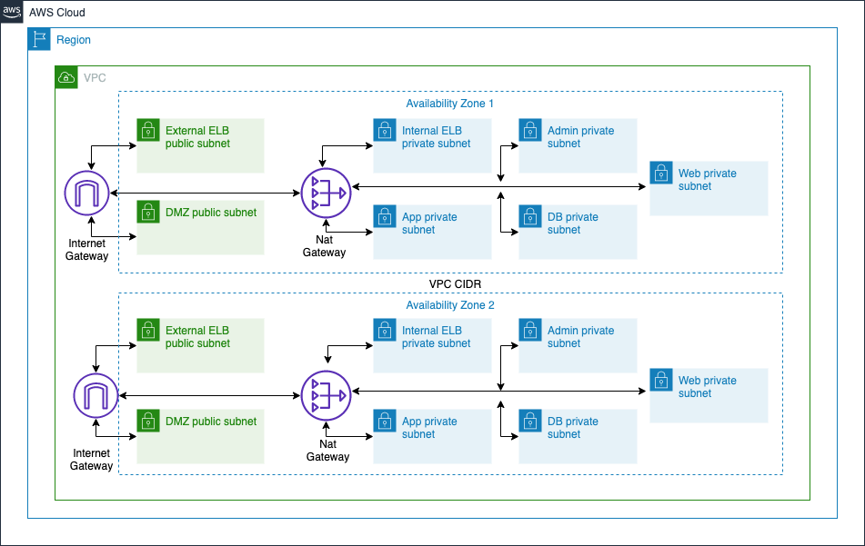

### Introduction to Amazon Layered Virtual Priavte Cloud Architecture  

- **1. Overview**
  - This blog describes the basic Seven Layered network architecture. The following diagram shows the various components of the architecture; the VPC with two availability zones with several AWS Services, each of which is in place to support the organization within AWS Cloud.
  - Each service has a high-level description in the sections below that provides an overview of that particular component. 

- **2. Architecture Diagram**

     

  - The Seven Layers in the Architecture: A brief description of the seven layers is provided below.

       <table>
               <tr>
               <td>Subnet Name</td>
               <td>Description</td>
               <td>Visibility Type</td>
               <td>Example</td>
               </tr>
               <tr>
               <td>External ELB Subnet</td>
               <td>The traffic to web instances is routed through external ELB which is by default public. The external ELB is accessible from outside</td>
               <td>Public facing</td>
               <td>Internet facing AWS LoadBalancer</td>
               </tr>
               <tr>
               <td>DMZ Subnet</td>
               <td>The purpose of a DMZ is to add an additional layer of security to an organization's local area network (LAN); an external network node only has direct access to equipment in the DMZ, rather than any other part of the network. The network related services are present in this DMZ layer.
               </td>
               <td>Public facing</td>
               <td>AWS Nat gateway</td>
               </tr>
               <tr>
               <td>Web Subnet</td>
               <td>Web subnet has Web Servers instances, traffic flow is from load balancer to the web layer.The flow is from web layer to load balancer.</td>
               <td>Private facing</td>
               <td>AWS EC2 hosting web server like Apache, Tomcat etc</td>
               </tr>
               <tr>
               <td>Internal ELB Subnet</td>
               <td>The functionality of internal ELB is to route the traffic coming from Web subnets (web instances) to App subnets (App instances).The internal ELB is accessible only within the VPC</td>
               <td>Private facing</td>
               <td>AWS LoadBalancer accesible within respective AWS VPC</td>
               </tr>
               <tr>
               <td>App Subnet</td>
               <td>App subnet is leveraged by server hosting application services. It is also called a storage subnet.</td>
               <td>Private facing</td>
               <td>AWS EC2 hosting application like JBoss etc</td>
               </tr>
               <tr>
               <td>DB Subnet</td>
               <td>DB subnet has DB related servers</td>
               <td>Private facing</td>
               <td>AWS database services like RDS, Aurora, Redshift etc</td>
               </tr>
               <tr>
               <td>Admin Subnet</td>
               <td>Admin subnet manages the overall management/administration flow</td>
               <td>Private facing</td>
               <td>IAD, Splunk, Jenkins </td>
               </tr>
            </table>

- **3. Description of AWS Components**
   - A brief description of AWS components is provided below.
   
     - **VPC Design Details**
       - Amazon Virtual Private Cloud (Amazon VPC) is a dedicated virtual network. It is logically isolated from other virtual networks in the AWS cloud. It enables you to launch AWS resources, such as Amazon EC2 instances, into VPC. 
       - When VPC is created, a set of IP addresses for the VPC are specified in the form of a Classless Inter-Domain Routing (CIDR) block. The following table     shows VPC CIDR details.
       
            <table>
                 <th colspan="2">VPC</th>
                 <tr>
                 <td>Name</td>
                 <td>CIDR Block</td>
                 </tr>
                 <tr>
                 <td>xxx-vpc-poc</td>
                 <td>10.0.0.0/16</td>
                 </tr>
            </table>
       
     - **Subnet Details**
       - Subnet is a range of IP addresses in the VPC. AWS resources launched into a subnet that you select, a public subnet is used for resources that must be    connected to the Internet, and a private subnet for resources that won't be connected to the Internet. The following table shows subnet details.
              
            <table>
               <th colspan="5">Subnet</th>
               <tr>
               <td>Name</td>
               <td>Tier</td>
               <td>Type</td>
               <td>Ranges (logical)</td>
               <td>Availability Zone</td>
               </tr>
             <tr>
             <td>xxxxx- xelb-2a-pub</td>
             <td>External ELB</td>
             <td>Public</td>
             <td>10.0.1.xxx</td>
             <td>us-west-2a</td>
             </tr>
             </table>
       
      - **Security Groups**
        - A security group acts as a virtual firewall for instance to control inbound and outbound traffic. The following table describes the rules for security groups.
        
             <table>
             <th colspan="5">Security Group</th>
             <tr>
             <td>Security Group Name</td>
             <td>Inbound Ports</td>
             <td>Inbound Source</td>
             <td>Outbound Ports</td>
             <td>Outbound Source</td>
             </tr>
             <tr>
             <td>xxxxx-xelb-sg</td>
             <td>8080</td>
             <td>0.0.0.0/0</td>
             <td>All</td>
             <td>0.0.0.0/0</td>
             </tr>
             </table>

      - **Route Tables**
        - A route table contains a set of rules, called routes that are used to determine where network traffic is directed.  The following table describes the route table rules.
             
             <table>
             <th colspan="2">Public Route Table</th>
             <tr>
             <td>Destination</td>
             <td>Target</td>
             </tr>
             <tr>
             <td>10.0.0.0/16</td>
             <td>local</td>
             </tr>
             <tr>
             <td>0.0.0.0/0</td>
             <td>igw</td>
             </tr>
             </table>
             <table>
             <th colspan="2">Private Route Table</th>
             <tr>
             <td>Destination</td>
             <td>Target</td>
             </tr>
             <tr>
             <td>10.0.0.0/16</td>
             <td>local</td>
             </tr>
             </table>
             
        - By design, each subnet must be associated with a route table, which specifies the allowed routes for outbound traffic leaving the subnet. The following table shows the route table and subnet associations. 
             
             <table>
             <tr>
             <td>RouteTable Name</td>
             <td>Subnet Association</td>
             </tr>
             <tr>
             <td>public-route</td>
             <td>xxxxx-xelb-2a-pub</td>
             </tr>
             </table>
        
      - **Network Access Control Lists (NACL)**
        - A Network Access Control List is an optional layer of security that acts as a firewall for controlling traffic in and out of a subnet. Network ACLs with rules similar to security groups adds an additional layer of security to VPC. The following table describes the NACL rules.
        
            <table>
             <th colspan="6">NACL</th>
             <tr>
             <td>NACL Name</td>
             <td>Rule</td>
             <td>Protocol</td>
             <td>Port</td>
             <td>Allow/Deny</td>
             <td>Inbound/Outbound</td>
             </tr>
             <tr>
             <td>xxxxx-pub-nacl</td>
             <td>110</td>
             <td>FTP</td>
             <td>20,21</td>
             <td>Deny</td>
             <td>OUT</td>
             </tr>
             </table>

      - **NAT Gateway**
        - Network Address Translation (NAT) Gateway is used to enable instances in a private subnet to connect to the Internet or other AWS services, but prevent the Internet from initiating a connection with those instances.

      - **Internet Gateway (IGW)**
        - An Internet Gateway (IGW) is a horizontally scaled, redundant, and highly available VPC component that allows communication between instances in VPC and the Internet. It therefore imposes no availability risks or bandwidth constraints on network traffic. 
        - IGW serves two purposes: to provide a target in VPC route tables for Internet-routable traffic, and to perform network address translation (NAT) for instances that have been assigned public IP addresses.

      - **Cloud Trail**
        - AWS CloudTrail is a web service that records AWS API calls for customer AWS account and delivers log files. The recorded information includes the identity of the API caller, the time of the API call, the source IP address of the API caller, the request parameters and the response elements returned by the AWS service.

      - **Jump Host**
        - Jump host is a special-purpose instance on a network used to manage remote system login (RDP) in a separate security zone.

      - **Placement Group**
        - A placement group is a logical grouping of instances within a single Availability Zone. Using placement groups enables applications to participate in a low-latency, 10 Gbps network.

      - **Elastic Load Balancer (ELB)**
        - Elastic Load Balancing automatically distributes incoming application traffic across multiple Amazon EC2 instances in the cloud. It enables to achieve greater levels of fault tolerance in applications, seamlessly providing the required amount of load balancing capacity needed to distribute application traffic.
        - The following table provides the details of ELB.
        
            <table>
             <th colspan="5">Elastic Load Balancer</th>
             <tr>
             <td>ELB Type</td>
             <td>ELB Name</td>
             <td>Subnet</td>
             <td>SecurityGroup</td>
             <td>Attached Instances</td>
             </tr>
             <tr>
             <td>External</td>
             <td>xxxxxx-web-ext-elbc</td>
             <td>xxxxxx-xelb-2a-pub</td>
             <td>xxxxx-xelb-sg</td>
             <td>xxxxx-web-2a-01</td>
             </tr>
             </table>
      
      - **Identity and Access Management (IAM)**
        - The AWS Identity and Access Management (IAM) enables you to securely control access to AWS services and resources for your users. Using IAM, you can create and manage AWS users and groups, and use permissions to allow and deny their access to AWS resources.

          - **IAM Roles**
              - An IAM role is similar to a user. It is an AWS identity with permission policies, which determines what the identity can and cannot do in AWS. Roles are used to delegate access to users, applications or services that don't normally have access to AWS resources. 

          - **IAM Groups**
              - An IAM group is a collection of IAM users. IAM Groups are used to specify permissions for a collection of users, which can make those permissions easier to manage for those users.

          - **IAM Policy**
              - An IAM policy is a document that formally states one or more permissions.
          
               <table>
               <th colspan="4">IAM Policy</th>
               <tr>
               <td>Role Name</td>
               <td>Group Name</td>
               <td>Policy</td>
               </tr>
               <tr>
               <td>xxxxx-poc-superadmin-role</td>
               <td>xxxxxx-superadmin-group</td>
               <td>IAM full access</td>
               </tr>
               <tr>
               <td>xxxxx-serveradmin-role</td>
               <td>xxxxx-serveradmin-group</td>
               <td>Full access(EC2,ECS,ElasticBeanstalk,
                 Lambda,Autoscaling,ElasticloadBalancing,
                 CloudWatch) </td>
               </tr>
               </table>

